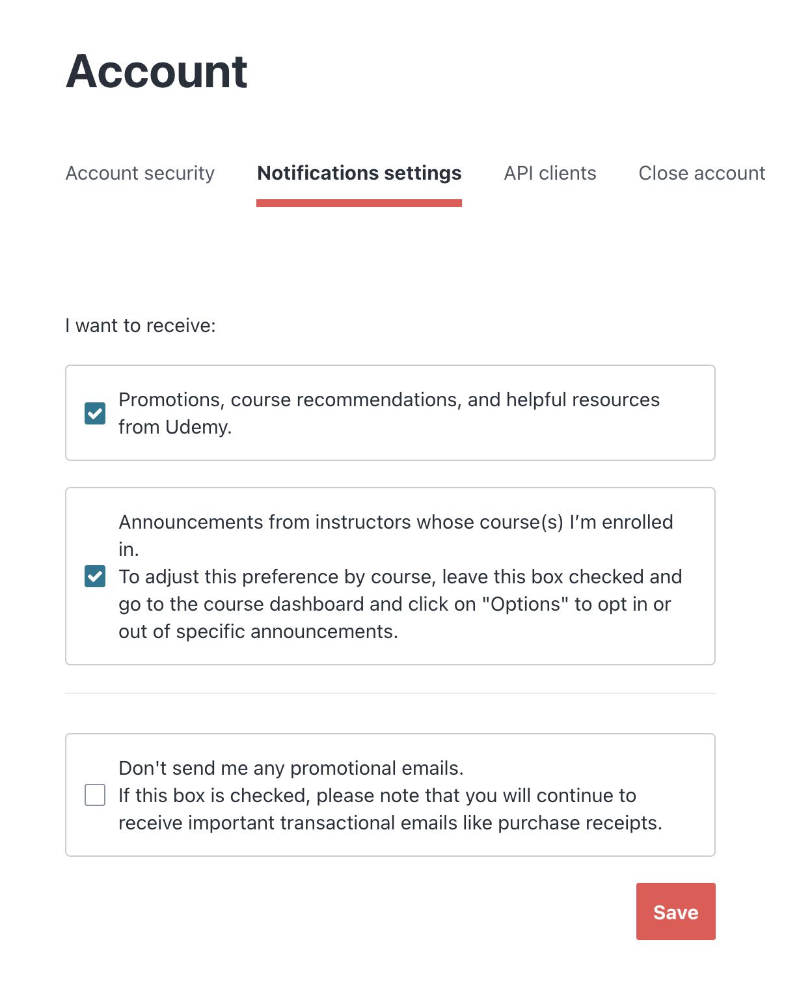

# S01P09: Monthly Coding Challenges, Free Resources and Guides

Every month in the community, we will have [**coding challenges**](https://zerotomastery.io/community/coding-challenges/) for you to participate in, [**monthly industry blogs**](https://zerotomastery.io/blog/) and other [**top free resources**](https://zerotomastery.io/resources/) emailed to you. We also have annual events like *Advent of Code*🎄, *Hacktoberfest* 👾, and *Frosty February Hackathon*☃️, plus some *giveaways* 🎁 as well.
每个月，我们都会在社区里举办[**编程挑战赛** ](https://zerotomastery.io/community/coding-challenges/)，[ **每月还会通过电子邮件向您发送行业博客**](https://zerotomastery.io/blog/)和其他[**优质免费资源** ](https://zerotomastery.io/resources/)。此外，我们还有年度活动，例如 *Advent of Code* 🎄、 *Hacktoberfest* 👾 和 *Frosty February Hackathon* ☃️，以及一些*赠品* 🎁。

Make sure you have your email settings on Udemy to allow this, as every month we will be emailing you a community update email where we list all of the new challenges, free resources, videos and giveaways.
请确保您在 Udemy 的电子邮件设置中允许接收此类邮件，因为我们每个月都会向您发送一封社区更新邮件，其中列出了所有新的挑战、免费资源、视频和赠品。

Some students have mentioned they do not receive these emails and it's mainly because of this *(Go to Your profile Icon and click:* ***Account > Notification Settings\****)*. Make sure you have these 2 boxes checked if you want to receive the monthly email like in the image below.
部分学生反映收不到这些邮件，主要原因在于此 *（点击个人资料图标，然后点击：* ***账户和通知设置\*** *）* 。如果您希望收到每月发送的邮件（如下图所示），请确保勾选这两个复选框。

**PS. Udemy will be asking to leave a review throughout the course. Please leave a review as it really helps out the course and allows more people to discover us in this massive marketplace :)**
