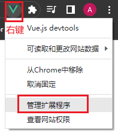
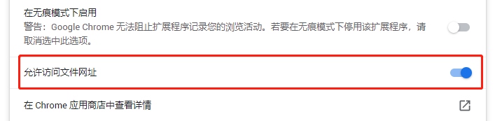
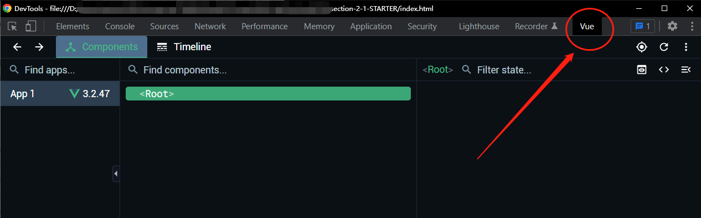

# S02P11: Vue Dev Tools

- section-2-1-STARTER.zip
- section-2-1-COMPLETE.zip
- **Vue installation** - https://vuejs.org/guide/quick-start.html#using-vue-from-cdn (2023/04/25 updated, v3.2.47)

When opening the `index.html` file without a local server, the Vue dev tools extension is deactivated by default.

How to activate Vue Dev Tools under file protocol?

1. Right click on the icon:

2. Switch on the option below:

Now a `Vue` tab would appear in Chrome's console:

