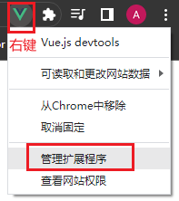
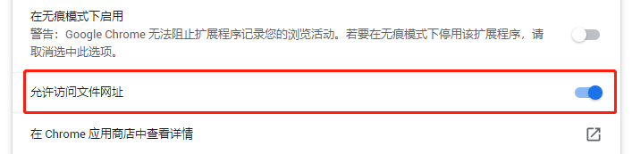
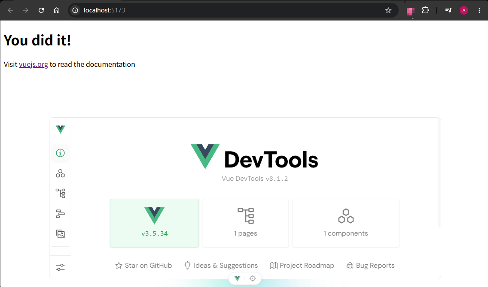

# S02P11: Vue Dev Tools

---


When opening the `index.html` file without a local server, the Vue dev tools extension is deactivated by default.

How to activate Vue Dev Tools under file protocol?

1. Right click on the icon:



2. Switch on the option below:



Now a `Vue` tab would appear in Chrome's console:


> [!tip]
>
> **最新修订**
>
> 视频中的 `Vue` 版本为 `v3.2.37`，对应时间 `2022-06-06` 至 `2022-08-30`。目前通过浏览器插件安装的 `DevTools` 的方式已经废弃，主流做法是通过 `Vite` 脚手架安装 `Vue` 调试工具插件：
>
> ```bash
> # Node: v25.9.0, Vue: v3.5.34, Vite: v8.0.8
> npm create vue@latest
> # or
> npm create vue@3.22.3
> Package name:
> │  vite-demo
> │
> ◇  Use TypeScript?
> │  No
> │
> ◇  Select features to include in your project: (↑/↓ to navigate, space to select, a to toggle all, enter to confirm)
> │  none
> │
> ◇  Select experimental features to include in your project: (↑/↓ to navigate, space to select, a to toggle all, enter to confirm)
> │  none
> │
> ◇  Skip all example code and start with a blank Vue project?
> │  Yes
> # install packages and init proj
> npm install
> npm run dev
> ```
>
> 最终效果：
>
> 