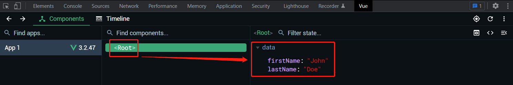

# S02P12: Working with Data

Resources:

- section-2-1-STARTER.zip
- section-2-1-COMPLETE.zip
- **Vue installation** - https://vuejs.org/guide/quick-start.html#using-vue-from-cdn (2023/04/25 updated, v3.2.47)

> **Difference between Expression & String interpolation**
>
> - **Expression** are the code inside the curly brackets
> - **String interpolation** is the <u>*process*</u> of replacing placeholder into string values
>
> e.g.: 
>
> The expression **{{ firstName }}** is *interpolated* into **John**
>
> ChatGPT assistance: 
>
> > Me: 你是一名Vue.js的核心成员，下面这句话应该怎么翻译：the expression {{ firstName }} is interpolated into John
> >
> > GPT: 这句话的意思是“表达式{{ firstName }}被插值为John”。其中，插值是Vue.js中的一个术语，表示将数据绑定到模板中的过程。在这个例子中，模板中的{{ firstName }}表达式被插入了数据John，也就是说，模板中的这个地方最终会显示为John。

大括号语法仅在 `mount` 方法指定的 **元素内** 生效。不在元素内的写法，`Vue` 无法解析成对应的值。

另外，被绑定的变量（`property` 属性）必须位于 `data` 方法的返回对象中，否则也不生效。

对于没在视图中呈现的响应式变量，可以通过 Dev Tools 检查变量值：

这种方法也可用于检测一个 `Vue` 实例是否包含需要的数据。
