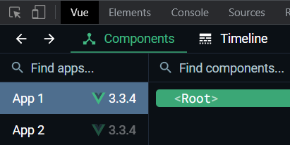
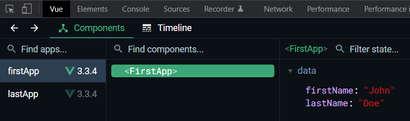
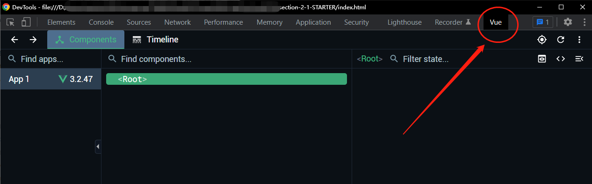

# S02P13: Multiple Vue Instances

---

> [!tip]
>
> **Vue installation** - https://vuejs.org/guide/quick-start.html#using-vue-from-cdn (`2023/06/01` updated, `v3.3.4`; `2026/05/14` updated, `v3.5.34`)

当 `mount` 挂载的 `DOM` 元素存在多个时，`mount(selector)` 只会匹配到符合条件的第一个元素。

想要多个元素同时渲染，必须分别调用 `mount` 方法，匹配对应的 `DOM` 容器元素：

```js
// first container
Vue.createApp({
    data() {
        return {
            firstName: 'John',
            lastName: 'Doe'
        }
    }
}).mount('#app1');

// second container
Vue.createApp({
    data() {
        return {
            firstName: 'Jane',
            lastName: 'Doe'
        }
    }
}).mount('#app2');
```

适用场景：页面存在多个 `widgets`（微件）且需要独立运维时。

此时控制台 `Vue` 标签会出现两个 `Vue` 实例：



要想区分这两个实例，可以自定义实例名称，使用 `name` 属性：

```js
// first container
Vue.createApp({
    name: 'firstApp',
    data() {
        return {
            firstName: 'John',
            lastName: 'Doe'
        }
    }
}).mount('#app1');

// second container
Vue.createApp({
    name: 'lastApp',
    data() {
        return {
            firstName: 'Jane',
            lastName: 'Doe'
        }
    }
}).mount('#app2');
```

结果如下：




> [!tip]
>
> **补充 DIY 代码**
>
> 本节实测代码详见 `code` 文件夹（由于浏览器未安装 `DevTools` 插件，故使用 `Vite` 单独构建 `vite-proj` 项目）
>
> 实测环境：
>
> - `node`：`v25.9.0`
> - `Vue`：`v3.5.34`（CDN：`https://unpkg.com/vue@3`）
>
> 核心逻辑：
>
> ```vue
> <script setup>
> import { ref } from 'vue'
> defineOptions({
>   name: 'firstApp'
> })
> 
> const firstName = ref('John')
> const lastName = ref('Doe')
> </script>
> 
> <template>
>   <div class="box">
>     <h1>First Vue Instance</h1>
>     <p>{{ firstName }} {{ lastName }}</p>
>   </div>
> </template>
> ```
>
> 实测结果：
>
> 