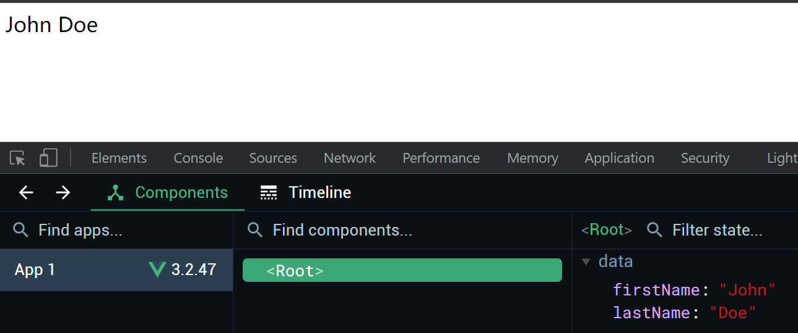
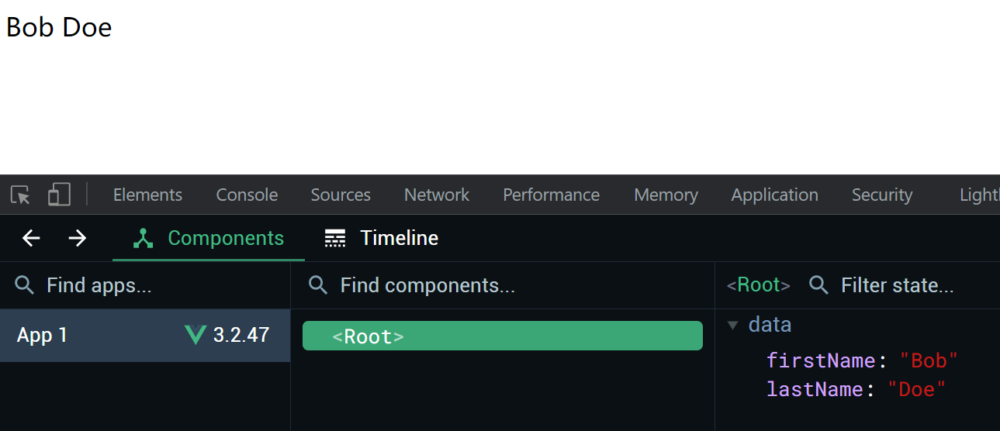

# S02P14: Accessing the Instance Data

Resources:

- section-2-1-STARTER.zip
- section-2-1-COMPLETE.zip
- **Vue installation** - https://vuejs.org/guide/quick-start.html#using-vue-from-cdn (2023/06/01 updated, v3.3.4)


将 `Vue.createApp(options)` 创建的 `Vue` 实例赋给一个变量（如 vm，即 ViewModel 的缩写）。这样就能通过 `vm.firstName` 的方式访问实例 `data` 中的 `firstName` 的值。

底层原理：`Proxy` 代理。

访问 `vm.firstName` 将实际触发 `vm` 的 `get firstName`。`get firstName` 会返回 `vm.$data.firstName` 的值


```js
const vm = Vue.createApp({
    data() {
        return {
            firstName: 'John',
            lastName: 'Doe'
        }
    }
}).mount('#app');

setTimeout(() => vm.firstName = 'Bob', 2000);
```

before:



after:


