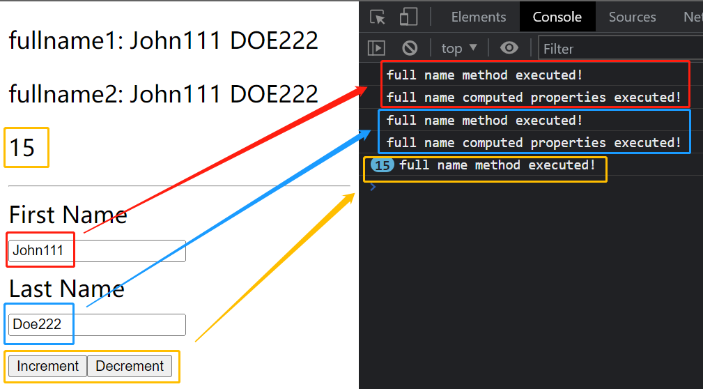

# S02P25: Computed Properties

Resources:

- section-2-11-COMPLETE.zip
- **Vue installation** - https://vuejs.org/guide/quick-start.html#using-vue-from-cdn (2023/06/01 updated, v3.3.4)


Vue 文档：[Computed Properties](https://vuejs.org/guide/essentials/computed.html)

## 0 案例准备

通过拼接两个响应式变量 `this.firstName` 和 `this.lastName`，在页面上分别用 **方法** 和 **计算属性** 渲染 `fullName1` 和 `fullName2`：

```vue
<template>
  <div id="app" v-cloak>
    <p>fullname1: {{ fullName1() }}</p>
    <p>fullname2: {{ fullName2 }}</p>
    <p>{{ age }}</p>
    <hr />
    <label>First Name</label>
    <input type="text" v-model="firstName" />
    <label>Last Name</label>
    <input type="text" v-model="lastName" />
    <button type="button" @click="age++">Increment</button>
    <button type="button" @click="age--">Decrement</button>
  </div>
</template>
<script>
    const vm = Vue.createApp({
        data() {
            return {
                firstName: 'John',
                lastName: 'Doe',
                age: 20
            }
        },
        methods: {
            fullName1() {
                console.log('full name method executed!');
                return `${this.firstName} ${this.lastName.toUpperCase()}`
            },
        },
        computed: {
            fullName2() {
                console.log('full name computed properties executed!');
                return `${this.firstName} ${this.lastName.toUpperCase()}`
            },
        },
    }).mount('#app')
</script>
<style scoped>
    body { font-size: 22px; }
    input[type="text"] { margin: 10px 0; display: block; }
    [v-cloak] { display: none; }
</style>
```

运行结果：




## 1 Compute 含义

Put simply, compute means to **calculate something**. This can be any sort of calculation from basic math to concatenating strings to form a full word, phrase or sentence. Any time you have to perform calculations on a value or multiple values, you are performing a computation.

简而言之，compute 意味着 **计算某物**。可以是基本的数学运算，也可以是连接字符串来形成完整的单词、短语或句子的任何类型的计算。当必须对一个或多个值执行计算（calculation）时，就是在执行一个 computation 计算。


## 2 缓存效应

计算一个属性，放入计算属性比放入方法效率更高。原因是计算属性做了缓存处理，data 中的无关属性在更新时不会连带着重复计算；而方法则会。通常计算逻辑越重，方法的执行效率越低。

`data` 属性一旦变更，`methods` 中的所有方法都会重新执行一遍。


## 3 特点

- 定义时是一个 **函数**，而使用时则为一个 **属性**（定义的函数在 `Vue` 后台执行）
- 计算属性的值默认为只读的（通过 `getter` 访问）。若要该值可写，则要手动创建 `get` 和 `set` 方法（详见 [Writable Computed](https://vuejs.org/guide/essentials/computed.html#writable-computed)）
- 通过 **缓存** 提升渲染性能，其他无关的响应式变更不触发该属性更新
- 在计算属性方法体内、但不参与最终运算的响应式变量，也会触发计算属性的值更新
- 不接收参数（而方法可以）
- 不可用于异步操作或更新 `DOM`
