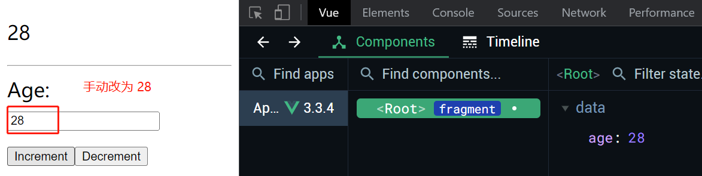
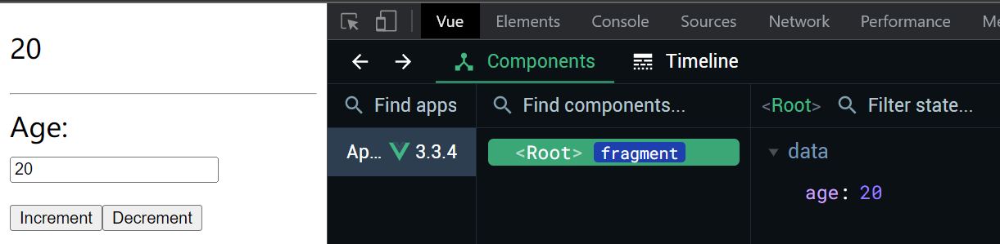

# S02P26: Watchers

Resources:

- section-2-17-COMPLETE.zip
- **Vue installation** - https://vuejs.org/guide/quick-start.html#using-vue-from-cdn (2023/06/01 updated, v3.3.4)


`watchers`（监听器）通常不像 `data`、`methods` 或 `computed` 常见，要视项目需求而定。

`watchers` 可以监听响应式变量的变更情况，并处理一些额外逻辑。

监听器既可以实现同步逻辑，也能实现异步逻辑；而计算属性只能实现同步逻辑，不支持异步。

---

异步操作示例：

让 `age` 更新 3 秒后，自动变为 20：

```vue
<template>
  <div id="app" v-cloak>
    <p>{{ age }}</p>
    <hr />
    <label for="age">Age: </label>
    <input id="age" type="text" v-model.lazy="age" />
    <button type="button" @click="age++">Increment</button>
    <button type="button" @click="age--">Decrement</button>
  </div>
</template>
<script>
    const vm = Vue.createApp({
      data() {
          return { age: 20 }
      },
      watch: {
        age(newVal, oldVal) {
          setTimeout(() => this.age = 20, 3000)
        }
      }
    }).mount('#app')
</script>
```

运行结果：



等待 3 秒后：

