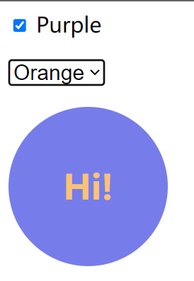

# S02P27: Binding Classes

Resources:

- section-2-18-STARTER.zip
- **Vue installation** - https://vuejs.org/guide/quick-start.html#using-vue-from-cdn (2023/06/01 updated, v3.3.4)


本节重点介绍了 class 样式类的两种绑定方式：

- 按对象绑定
- 按数组绑定


## 1 按对象绑定

需求描述：通过切换多选框，动态切换页面圆圈的背景色（青转紫，紫转青）

```vue
<template>
    <div id="app">
        <label>
            <input type="checkbox" v-model="isPurple" /> Purple
        </label>
        <div class="circle" :class="{purple: isPurple}">
            Hi!
        </div>
    </div>
</template>
<script>
    let vm = Vue.createApp({
        data() {
            return { isPurple: false }
        }
    }).mount('#app')
</script>
<style scoped>
    .purple{ background-color: #767DEA; }
</style>
```

为了便于扩展，圆圈绑定的样式类可以放到一个计算属性（`circle_classes`）：

```js
let vm = Vue.createApp({
    data() { return { isPurple: false } },
    computed: {
        circle_classes() {
            return {purple: this.isPurple}
        }
    }
}).mount('#app')
```

相应的圆圈 div 改为：

```vue
<div class="circle" :class="circle_classes">
```


## 2 按数组绑定

需求描述：在切换圆圈背景色的基础上，新增一个下拉框，动态切换圆圈的字体颜色。

```vue
<template>
    <div id="app">
        <label>
            <input type="checkbox" v-model="isPurple" /> Purple
        </label>
        <select v-model="selectedColor">
            <option value="">White</option>
            <option value="text-black">Black</option>
            <option value="text-orange">Orange</option>
        </select>
        <div class="circle" :class="selectedColor">
            Hi!
        </div>
    </div>
</template>
<script>
    let vm = Vue.createApp({
      data() {
        return { 
          isPurple: false,
          selectedColor: ''
        }
      },
      computed: {
        circle_classes() {
          return {
            purple: this.isPurple
          }
        }
      }
    }).mount('#app')
</script>
<style>
    .purple{ background-color: #767DEA; }
    .text-black{ color: #424242; }
    .text-orange{ color: #FFC26F; }
</style>
```

若要同时绑定背景色和字体色的样式类，可以使用包含响应式变量的数组：

```vue
<div class="circle" :class="[circle_classes, selectedColor]">
```

运行结果：

