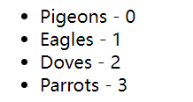

# S02P31: List Rendering

Resources:

- section-2-22-STARTER.zip
- **Vue installation** - https://vuejs.org/guide/quick-start.html#using-vue-from-cdn (2023/06/01 updated, v3.3.4)


本节介绍了三种使用 Vue 列表渲染的场景：

- 渲染普通数组
- 渲染对象数组
- 渲染对象键值对


## 0 准备工作

示例数据：

```js
let vm = Vue.createApp({
    data() {
        return {
            birds: ['Pigeons', 'Eagles', 'Doves', 'Parrots'],
            people: [
                { name: 'John', age: 20 },
                { name: 'Rick', age: 18 },
                { name: 'Amy', age: 33 }
            ]
        }
    }
}).mount('#app');
```


## 1 渲染普通数组

```vue
<div id="app">
    <ul>
        <li v-for="(bird, index) in birds" :class="bird">
            {{ bird }} - {{ index }}
        </li>
    </ul>
</div>
```

注意：`index` 不是必填项，如果不需要索引值 `index` 时，括号也可以省略：

```vue
<li v-for="bird in birds" :class="bird">
```

运行结果：




## 2 渲染对象数组

被遍历的当前对象，其属性值可以用 **点运算符** 引用：

```vue
<div id="app">
    <ul>
        <li v-for="person in people">
            {{ person.name }} - {{ person.age }}
        </li>
    </ul>
</div>
```


## 3 渲染对象键值对

通过 **点运算符** 访问对象属性在属性较多时写起来很繁琐，此时也可以用 `v-for` 进行对象遍历：

```vue
<div id="app">
    <ul>
        <li v-for="person in people">
            <div v-for="(value, key, index) in person">
                {{ key }}: {{ value }} - index: {{ index }}
            </div>
        </li>
    </ul>
</div>
```

运行结果：


如果不想渲染 `value`，可以不写：

```vue
<div v-for="(, key, index) in person">
```

如果只想用 `index`，`key` 也可以不写：

```vue
<div v-for="(, , index) in person">
```

牢记一点：始终确保代码简洁。


## 4 存在的问题

原视频中并未讲清楚为什么一定要用 `:key` 绑定，只说了为什么索引值不能用作元素的唯一标识，以及新增或删除元素时，可能因为没有跟踪具体元素，在不希望渲染的地方发生了渲染。至于为什么，并没有说清楚，也没有举例。

通过 `ChatGPT3.5` 得到的回答如下：

> 使用 `v-for` 指令进行循环渲染时，推荐为每个循环项提供一个唯一的 `key` 属性绑定。这个 `key` 属性的作用，是帮助 `Vue` 跟踪每个循环项，以便在更新循环时进行高效的重用和重排序。
>
> 更新 `Vue` 视图时，`Vue` 会使用虚拟 `DOM`（**Virtual DOM**）来比较新旧节点，并在需要时进行更新。通过为每个循环项提供唯一的 `key` 属性，`Vue` 可以快速判断新旧节点的变化，以确定是对节点进行重新渲染、重用还是删除和添加。如果没有 `key` 属性，`Vue` 将不得不使用一种较慢的 **比较算法** 来确定节点的变化，这可能导致性能下降。


## 5 官方文档

更多详情，可参考 Vue 官方文档（建议仔细阅读）：[List Rendering](https://vuejs.org/guide/essentials/list.html#list-rendering)

对于视频中未讲清楚的“问题”，可以重点阅读官网 [Maintaining State with `key`（通过 `key` 管理状态）](https://vuejs.org/guide/essentials/list.html#maintaining-state-with-key)

> 官网文档重要补充：
>
> - 定义 `v-for` 的变量别名时使用解构，和解构函数参数类似：`v-for="({ message }, index) in items"`
> - `v-for` 可以直接接受一个整数值，初值从 1 开始：`<span v-for="n in 10">{{ n }}</span>`
> - 也可以在 `<template>` 标签上使用 `v-for` 来渲染一个包含多个元素的块
> - 当 `v-if` 和 `v-for` 同时存在于一个节点上时（不推荐），`v-if` 比 `v-for` 的优先级更高。此时 `v-if` 的条件将无法访问到 `v-for` 作用域内的变量别名
> - `Vue` 默认按照 **就地更新** 的策略来更新通过 `v-for` 渲染的元素列表。当数据项的顺序改变时，`Vue` **不会** 随之移动 `DOM` 元素的顺序，而是就地更新每个元素，确保它们在原本指定的索引位置上渲染。
> - `key` 绑定的值期望是一个基础类型的值，而非对象型。
> - 在计算属性中使用 `reverse()` 和 `sort()` 的时候务必小心，最好在调用这些方法之前创建一个原数组的副本：`return [...numbers].reverse()`

