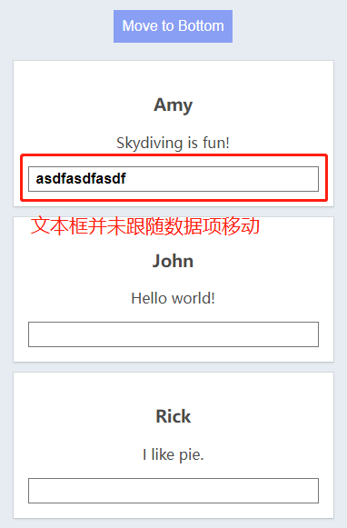

# S02P32: Understanding the role of the key attribute

Resources:

- section-2-23-STARTER.zip
- section-2-23-COMPLETE.zip
- **Vue installation** - https://vuejs.org/guide/quick-start.html#using-vue-from-cdn (2023/06/01 updated, v3.3.4)


本节用一个具体示例来阐明，为什么要在 `v-for` 指令中使用 `key` 绑定。

## 1 准备工作

```vue
<template>
	<div id="app">
        <button type="button" class="move">Move to Bottom</button>
        <div class="card">
            <h3>Name</h3>
            <p>Message</p>
        </div>
    </div>
</template>
<script>
let vm = Vue.createApp({
  data() {
    return {
      people: [
        { name: 'John', message: 'Hello world!' },
        { name: 'Rick', message: 'I like pie.' },
        { name: 'Amy', message: 'Skydiving is fun!' }
      ]
    }
  }
}).mount('#app')
</script>
```


## 2 添加文本框前

没有类似文本框这样的交互式表单元素，不加 `key` 绑定的渲染一切正常：

```vue
<div id="app">
    <button type="button" class="move" @click="move">Move to Bottom</button>
    <div class="card" v-for="{name: nm, message: msg} in people">
        <h3>{{ nm }}</h3>
        <p>{{ msg }}</p>
    </div>
</div>
<script>
let vm = Vue.createApp({
  data() { /*...*/ },
  methods: {
    move() {
      const first = this.people.shift();
      this.people.push(first);
    },
  },
}).mount('#app');
</script>
```


## 3 添加文本框后

只需要变更一下模板，新增一个普通文本框，就可以发现文本框并没有跟随数据项一起移动：

```vue
<div id="app">
    <button type="button" class="move" @click="move">Move to Bottom</button>
    <div class="card" v-for="{name: nm, message: msg} in people">
        <h3>{{ nm }}</h3>
        <p>{{ msg }}</p>
        <input type="text" />
    </div>
</div>
```

运行结果：



原因：基于性能考虑，`Vue` 不会频繁移动 `DOM` 元素，而是根据比较虚拟 `DOM` 的结果，动态更新数据，再通过绑定同步到视图。要让文本框随数据移动，就需要在 `v-for` 指令中指定 `key` 属性来标识元素项唯一性：

```vue
<div class="card" v-for="{name: nm, message: msg} in people" :key="nm">
```

更多详情，参考 Vue 官方文档（2023/06/03 更新）：[Maintaining State with `key`](https://vuejs.org/guide/essentials/list.html#maintaining-state-with-key)

