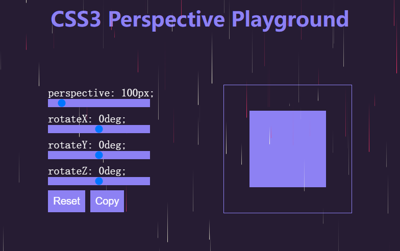
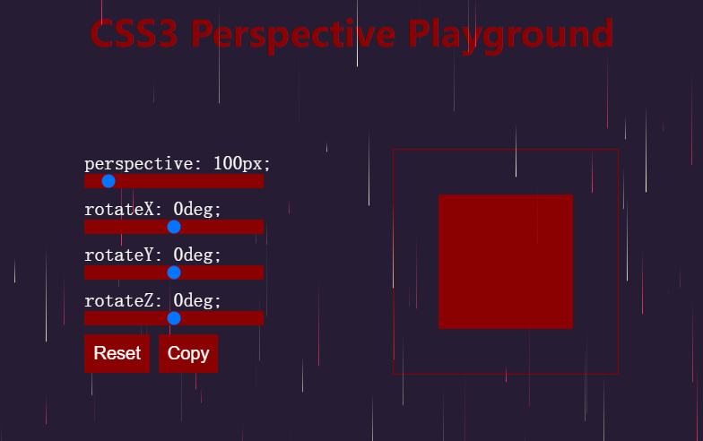
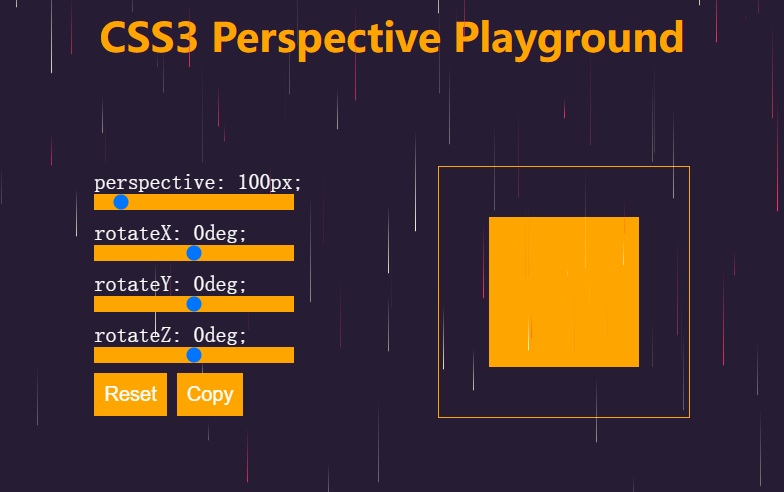

# S03P37: Extra Exercise: Copy Button

> **Requirement**
>
> As a challenge, and to also make this project "your own", see if you can create some custom CSS effects when you click on the COPY and RESET button. Once you are done, see if you can change the color scheme of the projects. Share your custom project in our **#vue** channel on Discord and show others what you have done :)

## 1 拓展训练目标

通过单击按钮，实现切换不同的配色方案。


## 2 实现途径

- `style` 绑定
- `class` 绑定


## 3 基本思路

单击按钮时，再执行一个方法 `toggleClr`，随机更新一个响应式变量的颜色值，然后通过计算属性自动同步到相关样式中。


## 4 关键代码

JS逻辑层：

```js
const colors = ['#8d81f3', 'red', 'blue', 'yellow', 'orange', 'violet', 'darkred'];
const vm = Vue.createApp({
  data() {
    return {
      /* ... */
      myColor: '#8d81f3',
      diy: 'diy0'
    }
  },
  computed: {
    /* ... */
    h2Clr() { return {color: this.myColor} },
    btnClr() { return { backgroundColor: this.myColor } },
    bdrClr() { return { borderColor: this.myColor } },
    bkgClr() { return { background: this.myColor } },
  },
  methods: {
    toggleClr() {
      // generate random index
      const index = Math.floor(Math.random() * colors.length);
      // DOM related color binding (style)
      this.myColor = colors[index];
      // input range color binding (classes, or psudo classes)
      this.diy = `diy${index}`;
    },
    reset() {
      /* ... */
      this.toggleClr();
    },
    async copy() {
      /* ... */
      this.toggleClr();
    }
  }
}).mount('#app');
```

注意：第 12 - 15 行，对应该示例项目中所有和配色相关的 `DOM` 样式绑定。由于 `range` 元素的默认颜色修改需要分浏览器讨论，实操使用 `Chrome` 效果并不理想，仍未能控制滑块的样式（`-webkit-slider-thumb`），仅变更了滑轨的背景色（`-webkit-slider-runnable-track`）。

对应的 CSS 样式类：

```css
input[type="range"].diy0::-webkit-slider-runnable-track { background-color: #8d81f3;}
input[type="range"].diy1::-webkit-slider-runnable-track { background-color: red; }
input[type="range"].diy2::-webkit-slider-runnable-track { background-color: blue; }
input[type="range"].diy3::-webkit-slider-runnable-track { background-color: yellow; }
input[type="range"].diy4::-webkit-slider-runnable-track { background-color: orange; }
input[type="range"].diy5::-webkit-slider-runnable-track { background-color: violet; }
input[type="range"].diy6::-webkit-slider-runnable-track { background-color: darkred; }
```

视图模板关键更新：

```vue
<h2 :style="h2Clr">CSS3 Perspective Playground</h2>
<input type="range" min="0" max="999" v-model="perspective" :class="diy" />
<input type="range" min="-180" max="180" v-model="rotateX" :class="diy" />
<input type="range" min="-180" max="180" v-model="rotateY" :class="diy" />
<input type="range" min="-180" max="180" v-model="rotateZ" :class="diy" />
<button type="button" @click.prevent="reset" :style="btnClr">Reset</button>
<button type="button" @click.prevent="copy" :style="btnClr">Copy</button>
<div class="box-container" :style="bdrClr">
    <div class="box" :style="[box, bkgClr]" ></div>
</div>
```

完整代码，详见 [proj1_perspective_playground.zip](../assets/proj1_perspective_playground.zip)


## 5 运行效果

初始颜色：



换色1：



换色2：

