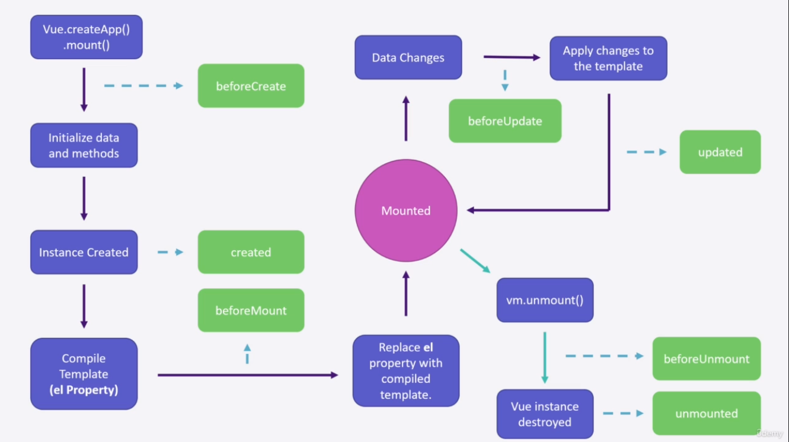

# S04P39: Understanding Lifecycle Hooks

Resources:

- section-4-1-STARTER.zip
- **Vue installation** - https://vuejs.org/guide/quick-start.html#using-vue-from-cdn (2023/06/01 updated, v3.3.4)

本节详细展示了 Vue 3 中的生命周期钩子。其中较大的不同是出现了 `unmounted` 和 `beforeUnmount` ——

在 Vue 3 中，`beforeDestroy` 和 `destroyed` 生命周期钩子被移除，取而代之的是 `beforeUnmount` 和 `unmounted`。

这个改变是因为 Vue 3 采用了 **基于函数** 的组件 API (Composition API) 来替代 Vue 2 中的 **选项式 API**。基于函数的组件 API 提供了更灵活和可组合的方式来组织和管理组件的逻辑。

在 Vue 2 的选项式 API 中，组件的生命周期钩子是以选项的形式声明在组件定义中。而在 Vue 3 的基于函数的组件 API 中，通过使用 `onBeforeUnmount` 和 `onUnmounted` 函数，可以在组件中实现类似 `beforeDestroy` 和 `destroyed` 的功能。

下面是 Vue 2 中的生命周期钩子与 Vue 3 中的对应关系：

- `beforeCreate` → `setup()`
- `created` → `setup()`
- `beforeMount` → `onBeforeMount`
- `mounted` → `onMounted`
- `beforeUpdate` → `onBeforeUpdate`
- `updated` → `onUpdated`
- `beforeDestroy` → `onBeforeUnmount` (Vue 3)
- `destroyed` → `onUnmounted` (Vue 3)

使用 Vue 3 的基于函数的组件 API，您可以通过在 `setup()` 函数中使用 `onBeforeUnmount` 和 `onUnmounted` 来实现在组件销毁前和销毁后的逻辑处理。这种改变是为了提供更一致和更可预测的生命周期行为，并使开发者能够更好地组织和重用组件的逻辑。

需要注意的是，在迁移到 Vue 3 时，您需要根据新的生命周期钩子名称来更新您的代码，以适应新的基于函数的组件 API。