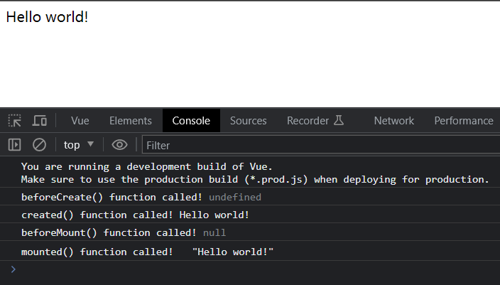
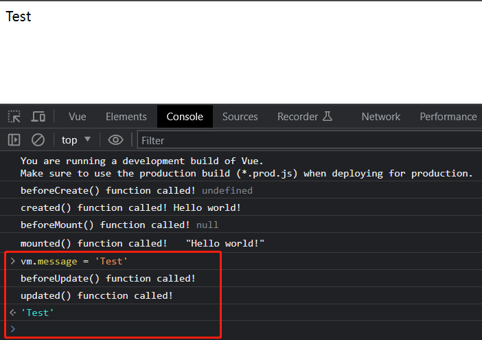
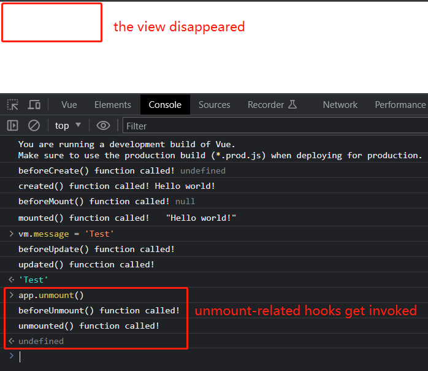
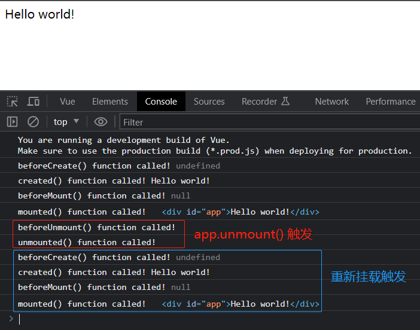
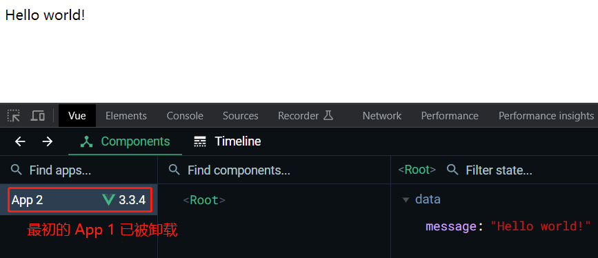

- # S04P40: Understanding Lifecycle Hooks

  Resources:

  - section-4-3-COMPLETE.zip
  - **Vue installation** - https://vuejs.org/guide/quick-start.html#using-vue-from-cdn (2023/06/01 updated, v3.3.4)


本节对 `Vue3` 的 8 个生命周期钩子进行了举例说明：

- `beforeCreate`
- `created`
- `beforeMount`
- `mounted`
- `beforeUpdate`
- `updated`
- `beforeUnmount`
- `unmounted`


## 1 beforeCreate, created, beforeMount, mounted

代码如下：

```vue
<template>
  <div id="app">
    {{ message }}
  </div>
</template>
<script>
let app = Vue.createApp({
  data() {
    return {
      message: "Hello world!"
    }
  },
  beforeCreate() {
    console.log('beforeCreate() function called!', this.message)
  },
  created() {
    console.log('created() function called!', this.message)
  },
  beforeMount() {
    console.log('beforeMount() function called!', this.$el)
  },
  mounted() {
    console.log('mounted() function called!', this.$el)
  },
  beforeUpdate() {
    console.log('beforeUpdate() function called!')
  },
  updated() {
    console.log('updated() funcction called!')
  },
  beforeUnmount() {
    console.log('beforeUnmount() function called!')
  },
  unmounted() {
    console.log('unmounted() function called!')
  }
});
const vm = app.mount('#app');
</script>
```

运行结果：



## 2 beforeUpdate, updated

此时修改 `message` 的值，分别触发 `beforeUpdate` 和 `updated` 钩子：beforeUpdate




## 3 beforeUnmount, unmounted

再执行 `unmount` 方法，触发 `beforeUnmount` 和 `unmounted` 钩子：




## 4 关于重新绑定

视频演示到 应用实例 `app` 的解绑就结束了。实测时发现两个问题：

1. 如果 `createApp` 和 `mount` 链式调用后赋值给 `vm`，那么 `vm` 是无法调用 `unmount` 方法的，只能访问或修改 `message`；调用 `unmount` 必须通过 `createApp` 返回的结果（如赋给一个变量 `app`）才行（`mount` 和 `unmount` 被同一个对象调用）；
2. 如果想重新绑定到 DOM 元素，需要做如下变更：
   1. 将 `Vue.createApp` 封装为一个函数；
   2. 传入 `createApp` 的变量中必须要有显式声明的 `template` 模板值或渲染函数。

示例如下：

```vue
<template>
  <div id="app"> {{ message }} </div>
</template>
<script>
const createMyApp = () => Vue.createApp({
  template: `<div id='app'>{{message}}</div>`,
  data() {
    return {
      message: "Hello world!"
    }
  },
  beforeCreate() {
    console.log('beforeCreate() function called!', this.message)
  },
  created() {
    console.log('created() function called!', this.message)
  },
  beforeMount() {
    console.log('beforeMount() function called!', this.$el)
  },
  mounted() {
    console.log('mounted() function called!', this.$el)
  },
  beforeUpdate() {
    console.log('beforeUpdate() function called!')
  },
  updated() {
    console.log('updated() funcction called!')
  },
  beforeUnmount() {
    console.log('beforeUnmount() function called!')
  },
  unmounted() {
    console.log('unmounted() function called!')
  }
});
const app = createMyApp();
const vm = app.mount('#app');

// unmount app
app.unmount();

// re-mount app
const app1 = createMyApp();
const vm1 = app1.mount('#app');
</script>
```

运行结果：



观察 `Vue DevTools` 中的实例节点，原来的节点已经被卸载，只有新挂载的 `App 2` 实例：


