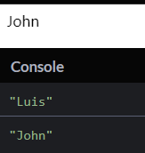

# S04P42: Understanding Reactivity with Proxies


本节通过 Excel 类比、CodePen 片段实例阐述 Proxy 在 Vue 中的应用。

CodePen 实操：

```html
<div id="app"></div>
```

```js
const data = {
  name: 'Luis'
};

const obj = new Proxy(data, {
  set(target, key, value) {
    document.querySelector('#app').innerText = value;
    target[key] = value;
  }
});

console.log(obj.name);
setTimeout(() => {
  obj.name = 'John';
  console.log(obj.name);
}, 2000);
```

运行结果：控制台先打印 `Luis`，两秒后页面和控制台同时打印 `John`：



`Proxy` 更多用法，详见 [MDN 文档](https://developer.mozilla.org/en-US/docs/Web/JavaScript/Reference/Global_Objects/Proxy)