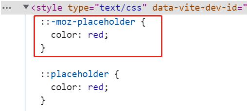

# S05P50: PostCSS


resouces:

- PostCSS: https://github.com/postcss/postcss
- PostCSS Parts: https://www.postcss.parts/


## 1 `Sass` 的编译原理

`Sass` 是一种预处理器，它需要在编译阶段将 `Sass` 代码转换为浏览器可理解的 `CSS` 代码。通常，开发者可以使用命令行工具、构建工具或与其他前端工具集成，将 Sass 代码编译为 `CSS`，并在网页中使用编译后的 `CSS` 样式表。

## 2 `PostCSS` 的编译原理

`PostCSS` 是一个用于转换 `CSS` 的 `JS` 库。其最大特点是支持用 `JavaScript` 操作与 `CSS` 对应的对象模型，然后再编译成最终的 `CSS` 样式。

> 来自 `ChatGPT` 的关于 `PostCSS` 的介绍
>
> `PostCSS` 是一种用于转换 `CSS` 的工具。它通过使用插件系统，允许开发者在解析和生成 `CSS` 的过程中进行自定义的转换和处理。与 `Sass` 等预处理器不同，`PostCSS` 不是一种新的 `CSS` 语法，而是建立在现有 `CSS` 规范之上的工具。
>
> `PostCSS` 的核心功能是将 `CSS` 解析为抽象语法树（**A**bstract Syntax **T**ree，`AST`），然后通过应用各种插件对 `AST` 进行处理，最终生成新的 `CSS` 代码。开发者可以根据需要选择和配置不同的插件，以实现各种功能和转换效果。
>
> `PostCSS` 的插件生态系统非常丰富，涵盖了各种功能，包括：
>
> 1. 自动添加 `CSS` 前缀：通过插件如 `Autoprefixer`，可以根据目标浏览器的兼容性要求，自动添加适当的 `CSS` 前缀，以确保样式在不同浏览器中正常工作。
> 2. `CSS` 变量处理：插件如 `postcss-css-variables` 可以解析和转换 `CSS` 变量，使其在不同浏览器中得到支持。
> 3. 压缩和优化：通过插件如 `cssnano`，可以对生成的 `CSS` 进行压缩和优化，以减小文件大小并提高加载性能。
> 4. 现代 `CSS` 语法支持：通过插件如 `postcss-preset-env`，可以使用最新的 `CSS` 语法和特性，而无需担心浏览器兼容性。
> 5. 嵌套和选择器处理：一些插件提供类似 `Sass` 的 **嵌套语法** 和 **选择器处理** 功能，以提高 `CSS` 代码的可读性和维护性。
>
> 使用 `PostCSS` 的优势在于它的灵活性和可扩展性。开发者可以根据项目需求选择适当的插件，并根据需要编写自定义插件，以实现特定的转换和处理逻辑。此外，`PostCSS` 还可以与其他构建工具和任务运行器（如 `Webpack`、`Gulp` 等）集成，以便自动化和优化 `CSS` 的构建流程。


## 3 示例：自动新增 CSS 样式前缀

`Vite` 自带 `PostCSS` 支持，只需创建一个配置文件 `postcss.config.js` 进行简单配置即可。

以自动添加样式的浏览器前缀为例（依赖 `autoprefixer` 第三方包）：

首先安装 `autoprefixer`：

```bash
$ npm install -D autoprefixer
```

新增如下配置：

```js
// postcss.config.js
module.exports = {
    plugins: [require('autoprefixer')]
}
```

然后在上节 `style.scss` 文件中加入以下内容：

```scss
::placeholder {
  color: red;
}
```

注意：这里添加到 `scss` 文件也是可以的，因为 `Sass` 的编译先于 `PostCSS`，最终也会被 `PostCSS` 处理。

运行 `Vite` 项目，在控制台查看页面 `CSS` 样式：（已生效）

