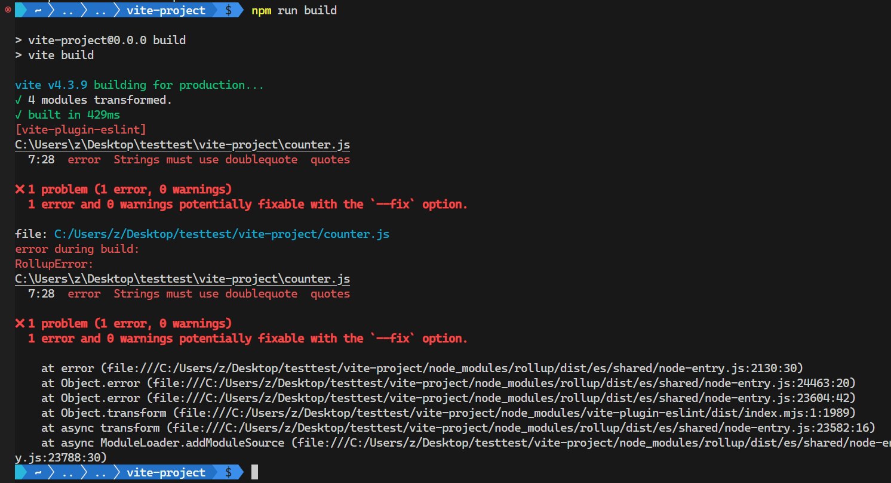

# S05P52: Configuring ESLint


resources:

- Configuring ESLint: https://eslint.org/docs/latest/rules/
- section-5-7-COMPLETE.zip


`ESLint` 的配置既可以放到 `package.json` 中，也可以单独存入一个配置文件。推荐使用后者便于管理。

新增配置文件 `.eslintrc`：

```json
{
    "rules": {
        "quotes": "error" // off | warn
    },
    "env": {
        "browser": true // will not throw errors related to the browser
    },
    "parserOptions": {
        "ecmaVersion": 2022,
        "sourceType": "module"
    }
}
```

然后运行项目（`npm run dev`）

由于使用的版本不同，开发模式下启动项目并不会报错，可以在构建 `dist` 包时发现错误提示：



更正问题既可以手动，也可以自动（但自动纠正失败后仍需手动修复）：

修改 `package.json`：

```json
{
    "scripts": {
        "lint": "eslint main.js counter.js postcss.config.cjs --fix"
    }
}
```

然后执行自动纠正：

```bash
$ npm run lint
```

再执行 `build` 构建命令就不报错了，单引号问题也自动修复了。

更多配置详情，详见 [`ESLint` 文档](https://eslint.org/docs/latest/rules/)。
