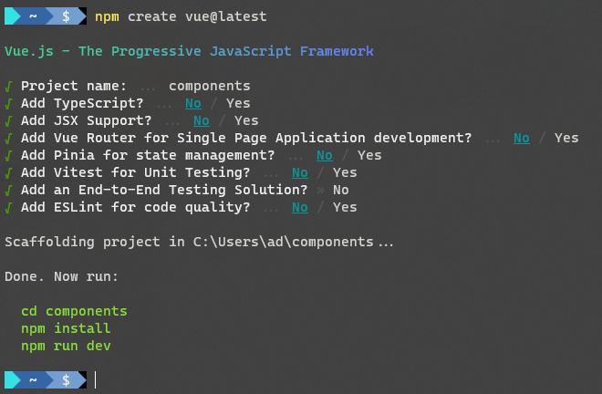

# S06P55: Scaffolding a Vue Project


从本单元开始详细讲解 `Vue` 的一些高级主题。本小节为使用命令行快速创建一个 `Vue` 项目。


## 1 脚手架简介

用到的最新脚手架工具（2023/06/10）：`create-vue`（详见 [GitHub 仓库](https://github.com/vuejs/create-vue/)）

作用：将分散在各处的项目资源（外部模块（如 `Vue.js`、`Axios.js` 等）、内部模块（`Main.js`、`Header.js`、`Footer.js`、`Content.js` 等等））通过一系列工具中间件（`Vite`、`Vue`、`PostCSS`…）最终打包编译为单独的项目文件（`bundle.js`、`bundle.css` 等）

`create-vue` 包的最大特点是基于 `Vite` 搭建，而传统 `vue-cli` 脚手架是基于 `Webpack` 打包的。

至于为什么更推荐 `Vite`，详见 [官方解释](https://vitejs.dev/guide/why.html)。

这里归纳如下：（根据 `ChatGPT` 整理）

- 更快的冷启动：Vite 使用了一种基于浏览器原生 ES 模块的开发服务器，可以在浏览器请求时按需编译和提供模块，从而实现了更快的冷启动速度。
- 真正的模块热重载：Vite 支持真正的模块热重载，无需刷新整个页面即可保持组件状态和数据，提供了更快、更自然的开发体验。
- 预构建：Vite 可以在构建过程中自动进行预构建，将源代码转换为高度优化的生产构建，以提供更快的生产构建速度和更小的包大小。
- 独立构建：Vite 支持独立构建，可以将每个模块作为单独的文件进行构建，避免了打包成一个巨大的文件，提高了开发和构建的效率。
- 开箱即用的 TypeScript 支持：Vite 提供了开箱即用的 TypeScript 支持，可以直接编写 TypeScript 代码而无需额外的配置。
- 插件系统：Vite 通过插件系统扩展了许多功能，如压缩、预处理器支持、自动引入依赖等，使开发过程更加灵活和高效。
- 生产模式优化：Vite 在生产模式下使用 Rollup 进行构建，提供了高度优化的构建输出，包括代码分割、按需加载等，以提供更好的性能和用户体验。


## 2 创建项目

创建最新版 `Vue` 项目：

```bash
$ npm create vue@latest
```

创建指定版本的 `Vue` 项目（`Vue 3`）：

```bash
# or vue@2 for Vue 2.x
$ npm create vue@3
# √ Project name: ... components
# with other options all set to No
$ cd components
$ npm i
$ npm run dev
```

运行命名后会看到一系列交互式询问选项，除了项目名需要指定为 `components`（本单元的重点），其余全部选 `No` 直到项目创建完成。


## 3 命令实操

实测结果：



根据提示启动项目：`npm run dev`

