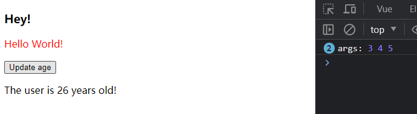
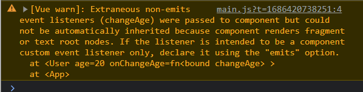

# S06P65: Emitting Events


本节介绍 Vue 组件相互通信的另一种方式：子传父。


## 1 关键代码

本质是通过发送一个事件通知父组件的响应式变量更新，如子组件中发送事件 `change-age`：

```vue
<template>
    <button @click="updateAge">Update age</button>
    <p>The user is {{ age }} years old!</p>
</template>
<script>
    export default {
        name: 'User',
        methods: {
            updateAge() {
                this.$emit('change-age', 3);
            },
        },
    }
</script>
```

随后在父组件监听该事件：

```vue
<template>
  <h3>Hey!</h3>
  <user :age="age" @change-age="changeAge"></user>
</template>
<script>
import User from '@/components/User.vue'
export default {
  name: 'App',
  components: {
    User
  },
  data() {
    return {
      age: 20
    }
  },
  methods: {
    changeAge(num) {
      this.age += num;
    }
  }
}
</script>
```


## 2 DIY 扩展——传递多个参数

实测发现，`this.$emit` 方法可以跟多个参数，只要父组件的处理逻辑包含这些参数，就都能访问到：

```js
// App.vue (parent comp)
export default {
  name: 'App',
  methods: {
    changeAge(num, ...args) {
      console.log('args:', num, ...args)
      this.age += num;
    }
  }
}
// User.vue (child comp)
export default {
    name: 'User',
    methods: {
        updateAge() {
            this.$emit('change-age', 3, 4, 5);
        },
    },
}
```

运行结果：（单击 <kbd>Update age</kbd> 两次后）




## 3 使用 emits 属性

作用：Vue 会尝试了解父组件应该监听到哪些事件。这也可以充当“另类文档”，明确该组件的用法。

如果缺少 emits 设置，控制台会出现警告：



解决办法，在子组件中新增 `emits` 数组：（L9）

```vue
<template>
    <button @click="updateAge">Update age</button>
    <p>The user is {{ age }} years old!</p>
</template>
<script>
    export default {
        name: 'User',
        props: ['age'],
        emits: ['change-age'],
        methods: {
            updateAge() {
                this.$emit('change-age', 3, 4, 5);
            },
        },
    }
</script>
```


## 4 基于 props 的计算属性

```vue
<template>
    <button @click="updateAge">Update age</button>
    <p>The user is {{ age }} years old!</p>
    <p>Age doubled: {{ ageDoubled }}</p>
</template>
<script>
    export default {
        name: 'User',
        props: ['age'],
        computed: {
            ageDoubled() {
                return this.age * 2;
            }
        },
        emits: ['change-age'],
        methods: {
            updateAge() {
                this.$emit('change-age', 3, 4, 5);
            }
        },
    }
</script>
```

注意：通过 `props` 传入的值最好是只读的。渲染子组件时，却可以通过计算属性关联出新的响应式变量。

运行结果：


