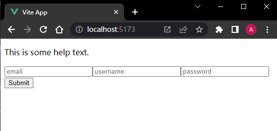

# S06P68: Inserting content with slots


本节演示了 `slot` 插槽在 Vue 项目中的基本应用。


## 1 新建项目：slots

以 `slots` 为项目名，快速新建一个 Vue 项目：

```bash
$ npm create vue@latest
# name: slots
# choose No for other options
$ cd slots
$ npm i
$ npm run dev
```

删除默认组件，仅保留 `App.vue`：

```vue
<template>
  <form>
    <div class="help">
      <p>This is some help text.</p>
    </div>
    <div class="fields">
      <input type="text" placeholder="email">
      <input type="text" placeholder="username">
      <input type="password" placeholder="password">
    </div>
    <div class="buttons">
      <button type="submit">Submit</button>
    </div>
  </form>
</template>
<script>
  export default {
    name: 'App'
  }
</script>
```

其中，`help` 包含一些表单填写说明文字；`fields` 为表单字段区；`buttons` 为按钮区，负责该表单的基本操作。

运行结果：




## 2 新增子组件

将表单重构到一个专门的组件 Form.vue，以便后期维护：

`src/components/Form.vue`：

```vue
<template>
  <form>
    <div class="help">
      <p>This is some help text.</p>
    </div>
    <div class="fields">
      <input type="text" placeholder="email">
      <input type="text" placeholder="username">
      <input type="password" placeholder="password">
    </div>
    <div class="buttons">
      <button type="submit">Submit</button>
    </div>
  </form>
</template>
```

同步更新 `App.vue` 的写法：

```vue
<template>
  <app-form />
</template>
<script>
  import AppForm from './components/Form.vue';
  export default {
    name: 'App',
    components: {
      AppForm
    }
  }
</script>
```

注意：子组件被命名为 `AppForm`，充分体现了语音化和遵循命名空间（`App`）的特点。这也是组件命名的最佳实践。


## 3 引入 slot 插槽

鉴于类似这样的表单结构可能在项目中大量出现，唯一的差别仅仅是具体表单内容，整体结构应保持一致。为了最大限度提供组件的复用性（如需要新增一个联系人表单），可以对整个表单进行分类，抽象出有共性的部分，再通过传参等方式动态引入具体表单内容。这里有两种实现方式：

- 通过 `props` 传参（涉及传 HTML 数据，少见）
- 通过 `slot` 插槽（推荐）

`Form.vue`：

```vue
<template>
  <form>
    <slot></slot>
  </form>
</template>
```

同时将父组件中的 `AppForm` 标签打开，在标签主体内粘贴最初的子组件内容：

```vue
<template>
  <app-form>
    <div class="help">
      <p>This is some help text.</p>
    </div>
    <div class="fields">
      <input type="text" placeholder="email">
      <input type="text" placeholder="username">
      <input type="password" placeholder="password">
    </div>
    <div class="buttons">
      <button type="submit">Submit</button>
    </div>
  </app-form>
</template>
```

我们希望在没有动态内容时，插槽可以提供一个默认值，写在子组件的 `slot` 标签主体内：（如：**No form to render**）

```vue
<template>
  <form>
    <slot>No form to render</slot>
  </form>
</template>
```

