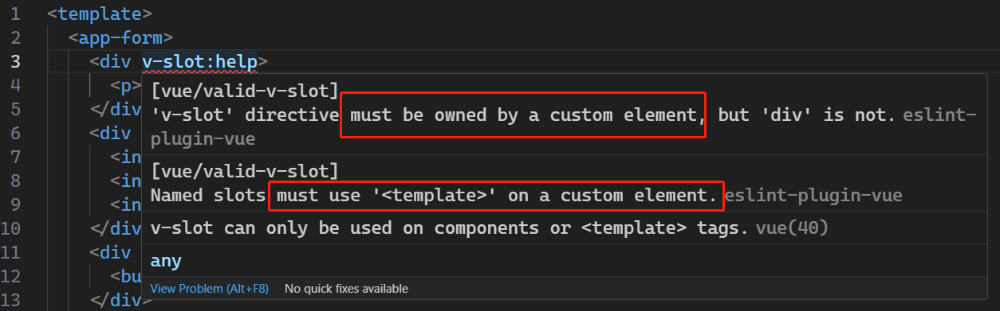
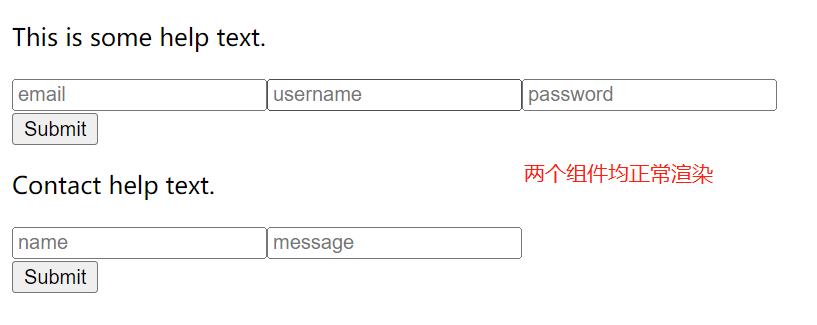
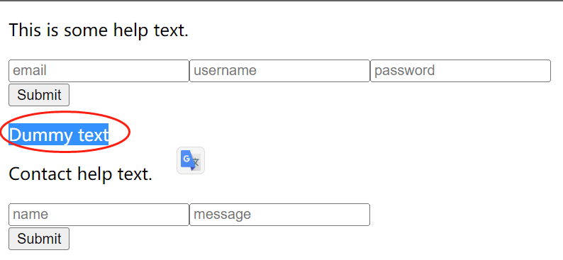

# S06P69: Named Slots


Resources:

- Slots: https://vuejs.org/guide/components/slots.html
- section-6-15-COMPLETE.zip


本节演示了具名插槽的使用。


## 1 准备工作

修改 `App.vue` 内容如下：

```vue
<template>
  <app-form>
    <div class="help">
      <p>This is some help text.</p>
    </div>
    <div class="fields">
      <input type="text" placeholder="email">
      <input type="text" placeholder="username">
      <input type="password" placeholder="password">
    </div>
    <div class="buttons">
      <button type="submit">Submit</button>
    </div>
  </app-form>
  <app-form>
    <div class="help">
      <p>Contact help text.</p>
    </div>
    <div class="fields">
      <input type="text" placeholder="name">
      <input type="text" placeholder="message">
    </div>
    <div class="buttons">
      <button type="submit">Submit</button>
    </div>
  </app-form>
</template>
```


## 2 引入具名插槽

假设两个 `AppForm` 子组件分别对应 **登录** 和 **联系人** 组件。由于二者具有相似的结构，只是结构内的具体内容不同，因此单独创建两个相似的组件并非最优解。Vue 插槽的最大优势在于，可以在组件内设定一个相对固定的框架，允许在该框架内填充不同的内容。

改造 `Form.vue` 如下：

```vue
<template>
  <div class="help">
    <slot name="help"></slot>
  </div>
  <div class="fields">
    <slot name="fields"></slot>
  </div>
  <div class="buttons">
    <slot name="buttons"></slot>
  </div>
</template>
```

这样，只需要在父组件指定不同的插槽即可，插槽之间通过自定义名称区分——即具名插槽。只需要对应位置添加 `v-slot` 指令并附上名称，代码如下：

`App.vue`：

```vue
<template>
  <app-form>
    <div v-slot:help>
      <p>This is some help text.</p>
    </div>
    <div v-slot:fields>
      <input type="text" placeholder="email">
      <input type="text" placeholder="username">
      <input type="password" placeholder="password">
    </div>
    <div v-slot:buttons>
      <button type="submit">Submit</button>
    </div>
  </app-form>
  <app-form>
    <div v-slot:help>
      <p>Contact help text.</p>
    </div>
    <div v-slot:fields>
      <input type="text" placeholder="name">
      <input type="text" placeholder="message">
    </div>
    <div v-slot:buttons>
      <button type="submit">Submit</button>
    </div>
  </app-form>
</template>
```

但此时出现了语法错误：



根据提示，这里应该换成 `template` 标签：

```vue
<template>
  <app-form>
    <template v-slot:help>
      <p>This is some help text.</p>
    </template>
    <template v-slot:fields>
      <input type="text" placeholder="email">
      <input type="text" placeholder="username">
      <input type="password" placeholder="password">
    </template>
    <template v-slot:buttons>
      <button type="submit">Submit</button>
    </template>
  </app-form>
  <app-form>
    <template v-slot:help>
      <p>Contact help text.</p>
    </template>
    <template v-slot:fields>
      <input type="text" placeholder="name">
      <input type="text" placeholder="message">
    </template>
    <template v-slot:buttons>
      <button type="submit">Submit</button>
    </template>
  </app-form>
</template>
```

运行结果：




## 3 联合使用具名插槽和默认插槽

如何在 `Form.vue` 中指定一个默认插槽（即没有特定名称），父组件上所有不带具体名称的内容都将在这个默认插槽渲染：（第 11 行）

```vue
<template>
  <div class="help">
    <slot name="help"></slot>
  </div>
  <div class="fields">
    <slot name="fields"></slot>
  </div>
  <div class="buttons">
    <slot name="buttons"></slot>
  </div>
  <slot></slot>
</template>
```

而 `App.vue` 中可以加入任意不在具名插槽内的 `HTML` 进行验证：（第 14 行）

```vue
<template>
  <app-form>
    <template v-slot:help>
      <p>This is some help text.</p>
    </template>
    <template v-slot:fields>
      <input type="text" placeholder="email">
      <input type="text" placeholder="username">
      <input type="password" placeholder="password">
    </template>
    <template v-slot:buttons>
      <button type="submit">Submit</button>
    </template>
    <p>Dummy text</p>
  </app-form>
</template>
```

运行结果：




## 4 利用插槽直接传参

插槽的另一个好处在于，可以直接从父组件传参，而无需设置 `props` 属性。例如，将第一个子组件的帮助说明通过 `App.vue` 的响应式变量传入：

```vue
<template>
  <app-form>
    <template v-slot:help>
      <p>{{ help }}</p>
    </template>
    <template v-slot:fields>
      <input type="text" placeholder="email">
      <input type="text" placeholder="username">
      <input type="password" placeholder="password">
    </template>
    <template v-slot:buttons>
      <button type="submit">Submit</button>
    </template>
    <p>Dummy text</p>
  </app-form>
  <app-form>
    <template v-slot:help>
      <p>Contact help text.</p>
    </template>
    <template v-slot:fields>
      <input type="text" placeholder="name">
      <input type="text" placeholder="message">
    </template>
    <template v-slot:buttons>
      <button type="submit">Submit</button>
    </template>
  </app-form>
</template>

<script>
import AppForm from './components/Form.vue'
export default {
  name: 'App',
  components: {
    AppForm
  },
  data() {
    return {
      help: 'This is some help text.'
    }
  }
}
</script>
```

注意：第 4 行插槽中的内容，是通过第 39 行从父组件 `App.vue` 定义的响应式变量传参实现的。如果传入的参数不需要在子组件内关联一个方法或计算属性，则通过插槽的方式接收父组件的值是一个很不错的选择。

组件的应用场景十分丰富，具体可参阅 [Vue 官方文档](https://vuejs.org/guide/components/slots.html)（强烈推荐认真阅读）。
