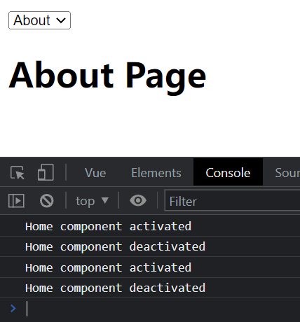

# S07P70: Dynamic Components

(9m38s)

Resources:

- section-6-16-COMPLETE.zip


## 1 实现一个动态组件效果

```bash
$ npm create vue@latest
# input project name: dynamic-components
# without any other plugins or tools
$ cd dynamic-components
$ npm i
$ npm run dev
```

删除无关内容，仅保留 `App.vue` 骨架：

```vue
<template>
  <select v-model="componentName">
    <option value="Home">Home</option>
    <option value="About">About</option>
  </select>

  <component :is="componentName" />
</template>

<script>
  import Home from '@/components/Home.vue';
  import About from '@/components/About.vue';

  export default {
    name: 'App',
    components: {
      Home,
      About
    },
    data() {
      return {
        componentName: 'Home'
      }
    }
  }
</script>
```

同时在 `components` 文件夹新建两个示例组件：`Home.vue` 和 `About.vue`

```vue
<!-- About.vue -->
<template>
    <h1>About Page</h1>
</template>
<!-- Home.vue -->
<template>
    <h1>Home Page</h1>
</template>
```


## 2 通过 `unmounted` 钩子监控 `Home.vue`

修改 `Home.vue`：

```vue
<template>
    <h1>Home Page</h1>
</template>

<script>
    export default {
        name: 'Home',
        unmounted() {
            console.log('Home component unmounted');
        }
    }
</script>
```

每次从 `Home` 切回 `About` 时，触发 `unmounted` 钩子。

缺点：频繁挂载/卸载，性能开销较大。


## 3 使用 keep-alive

### 3.1. keep-alive 的作用

> **何为 keep-alive** （摘自 ChatGPT）
>
> `<keep-alive>` 是 Vue.js 中的一个抽象组件，用于在组件之间缓存和重用已经创建过的组件实例。
>
> 在 Vue 中，当组件被频繁切换或销毁再创建时，可能会导致性能问题，特别是对于那些初始化较为耗时的组件。`<keep-alive>` 组件的作用就是缓存这些组件实例，以便在需要时重新使用它们，而不是每次都销毁和重新创建。
>
> `<keep-alive>` 组件可以包裹动态组件，将其包裹的组件实例缓存起来。当包裹的组件被切换时，其状态将被保留，不会被销毁，从而避免了重新创建和初始化的开销。这样可以提高应用的性能和响应速度。
>
> 下面是一个示例，演示了如何使用 `<keep-alive>`：
>
> ```vue
> <template>
>   <div>
>     <button @click="toggleComponent">Toggle Component</button>
>     <keep-alive>
>       <component v-if="showComponent" :is="currentComponent"></component>
>     </keep-alive>
>   </div>
> </template>
> 
> <script>
> export default {
>   data() {
>     return {
>       showComponent: true,
>       currentComponent: 'ComponentA'
>     };
>   },
>   methods: {
>     toggleComponent() {
>       this.showComponent = !this.showComponent;
>       this.currentComponent = this.showComponent ? 'ComponentA' : 'ComponentB';
>     }
>   },
>   components: {
>     ComponentA: {
>       template: '<div>Component A</div>'
>     },
>     ComponentB: {
>       template: '<div>Component B</div>'
>     }
>   }
> };
> </script>
> ```

### 3.2. keep-alive 实操

将 `App.vue` 模板修改为：（L7、L9）

```vue
<template>
  <select v-model="componentName">
    <option value="Home">Home</option>
    <option value="About">About</option>
  </select>

  <keep-alive>
    <component :is="componentName" />
  </keep-alive>
</template>
```

再配合两个新增的生命周期函数 `activated` 和 `deactivated`，可以实现更精细的控制：（L7 - L12）

```vue
<script>
    export default {
        name: 'Home',
        unmounted() {
            console.log('Home component unmounted');
        },
        activated() {
            console.log('Home component activated');
        },
        deactivated() {
            console.log('Home component deactivated');
        }
    }
</script>
```

运行情况：

