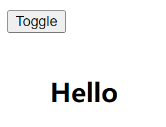
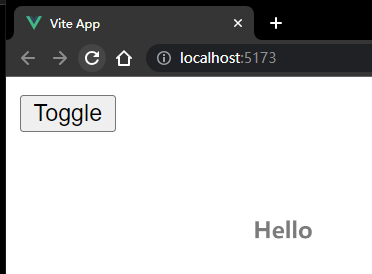

# S07P73: Animating with CSS Animations


Resources：

- section-7-1-STARTER.zip


本节介绍如何在 Vue 中应用 CSS 动画。


## 1 相关准备

沿用上一节的示例项目。清空或注释之前的 `transition` 组件。

```vue
<template>
  <button @click="flag = !flag">Toggle</button>

  <transition name="zoom">
    <h2 v-if="flag">Hello</h2>
  </transition>
</template>

<script>
export default {
  name: "App",
  data() {
    return {
      flag: false
    };
  }
};
</script>

<style>
h2 {
  width: 400px;
  padding: 20px;
  margin: 20px;
}
</style>
```


## 2 通过 CSS 设置缩放动画

定义两个关键帧 `zoom-in` 和 `zoom-out`，然后放到 Vue 的样式类中：

```vue
<template>
  <button @click="flag = !flag">Toggle</button>

  <transition name="zoom">
    <h2 v-if="flag">Hello</h2>
  </transition>
</template>

<script>
export default {
  name: "App",
  data() { return { flag: false } }
};
</script>

<style>
h2 {
  width: 400px;
  padding: 20px;
  margin: 20px;
}

.zoom-enter-active {
  animation: zoom-in 1s linear forwards;
}
.zoom-leave-active {
  animation: zoom-out 1s linear forwards;
}
@keyframes zoom-in {
  from {
    transform: scale(0, 0);
  }
  to {
    transform: scale(1, 1);
  }
}
@keyframes zoom-out {
  from {
    transform: scale(1, 1);
  }
  to {
    transform: scale(0, 0);
  }
}
</style>
```


## 3 animation 与 transition 连用

例如在缩放过程中加入淡入淡出效果：

```vue
<style>
.zoom-enter-active {
  animation: zoom-in 1s linear forwards;
  transition: all 1s linear;
}
.zoom-leave-active {
  animation: zoom-out 1s linear forwards;
  transition: all 1s linear;
}
.zoom-enter-from {
  opacity: 0;
}
.zoom-leave-to {
  opacity: 0;
}
</style>
```

此时会遇到一个问题：假如 `animation` 和 `transition` 的持续时间不同，以谁为准？答案是通过 `transition` 组件上的 `type` 属性手动指定：

- `type="animation"`：以 `animation` 时长为准；
- `type="transition"`：以 `transition` 时长为准；

这样，当 `type` 为 `animation`，而 `transition` 手动改为 2s 时长，则 `transition` 实现的淡入淡出动画不会执行完全。


## 4 在加载页面时自动生效动画

默认情况下页面加载后是没有动画效果的，例如将 `flag` 的初始值改为 `true`，页面加载时没有动画：



自动生效动画，需要在 `transition` 组件添加 `appear` 字样：（第 4 行）

```vue
<template>
  <button @click="flag = !flag">Toggle</button>

  <transition name="zoom" appear>
    <h2 v-if="flag">Hello</h2>
  </transition>
</template>
```

按 F5 刷新页面，将看到动画自动加载：


