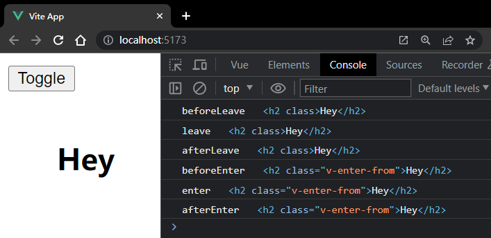

# S07P74: Animating with JavaScript


本节介绍了通过Vue内置的钩子控制页面动画的方法。


一共六大钩子：

- before-enter
- enter
- after-enter
- before-leave
- leave
- after-leave

此外还有两个不常用的钩子，用于取消动画：

- enter-cancelled
- leave-cancelled

示例代码：

App.vue：

```vue
<template>
  <button @click="flag = !flag">Toggle</button>
  <transition
    @before-enter="beforeEnter"
    @enter="enter"
    @after-enter="afterEnter"
    @before-leave="beforeLeave"
    @leave="leave"
    @after-leave="afterLeave"
  >
    <h2 v-if="flag">Hey</h2>
  </transition>
</template>

<script>
export default {
  name: "App",
  data() {
    return {
      flag: true
    };
  },
  methods: {
    beforeEnter(el) {
      console.log("beforeEnter", el);
    },
    enter(el, done) {
      console.log("enter", el);
      done();
    },
    afterEnter(el) {
      console.log("afterEnter", el);
    },
    beforeLeave(el) {
      console.log("beforeLeave", el);
    },
    leave(el, done) {
      console.log("leave", el);
      done();
    },
    afterLeave(el) {
      console.log("afterLeave", el);
    }
  },
};
</script>
```

注意：所有六个钩子的第一个参数都是目标 `DOM` 元素，唯独 `enter` 和 `leave` 多了第二个参数 `done`。它是一个回调函数，在动画执行结束时运行。

实测效果：


