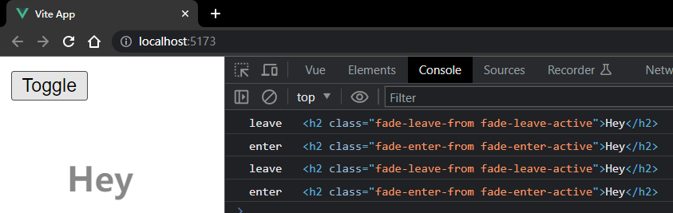

# S07P76: CSS and JavaScript Transitions


本节介绍怎样同时通过 `CSS` 和 `JavaScript` 接口设置动画。

两者同时生效的目的：方便各司其职。例如在通过 CSS 控制动画时，JS在后台执行其他任务。

基于 `JavaScript` 的 `enter` 和 `leave` 钩子，可以不声明第二个回调函数 `done`，`Vue` 会自动根据 `CSS` 配置的动画参数判定动画何时结束。

示例代码：

APP.vue：

```vue
<template>
  <button @click="flag = !flag">Toggle</button>
  <transition
    @enter="enter"
    @leave="leave"
    :css="true"
    name="fade"
  >
    <h2 v-if="flag">Hey</h2>
  </transition>
</template>

<script>
export default {
  name: "App",
  data() {
    return {
      flag: true
    };
  },
  methods: {
    enter(el) {
      console.log("enter", el);
    },
    leave(el) {
      console.log("leave", el);
    },
  },
};
</script>

<style>
h2 {
  width: 400px;
  padding: 20px;
  margin: 20px;
}
.fade-enter-from {
  opacity: 0;
}
.fade-enter-active {
  transition: all 1s linear;
}
.fade-leave-to {
  transition: all 1s linear;
  opacity: 0;
}
</style>
```

注意——

- 第 6 行：css 属性默认就是 true，这里只是强调
- 每次单击按钮切换文本的显示或隐藏，控制台都会打印相关信息，但时长设置却是从 CSS 中读取的（示例淡入淡出均为 1s）


