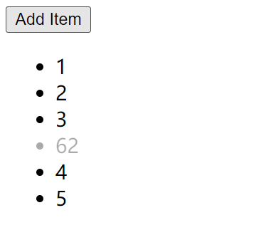

# S07P77: Animating a List


本节演示了在 `Vue` 项目中为列表添加动画的方法。


## 1 准备工作

准备一个响应式数组：`[1, 2, 3, 4, 5]`，单击按钮，在数组任意位置新增一个数字；单击数字则删除该数字：

```vue
<template>
  <button @click="addItem">Add Item</button>
  <ul>
    <li v-for="(number, index) in numbers"
      :key="number"
      @click="removeItem(index)"
    >
      {{ number }}
    </li>
  </ul>
</template>

<script>
export default {
  name: "App",
  data() {
    return {
      numbers: [1, 2, 3, 4, 5],
    };
  },
  methods: {
    addItem() {
      const num = Math.floor(Math.random() * 100) + 1;
      const index = Math.floor(Math.random() * this.numbers.length);
      this.numbers.splice(index, 0, num);
    },
    removeItem(index) {
      this.numbers.splice(index, 1);
    },
  },
};
</script>
```


## 2 添加淡入淡出效果

由于 `transition` 组件只适用于单个 DOM 元素，因此这里不能用于列表数据的动画设置。要使用 `transition-group`：

```vue
<template>
  <button @click="addItem">Add Item</button>
  <ul>
    <transition-group name="fade">
      <li v-for="(number, index) in numbers"
        :key="number"
        @click="removeItem(index)"
      >
        {{ number }}
      </li>
    </transition-group>
  </ul>
</template>

<script>
export default {
  name: "App",
  data() {
    return {
      numbers: [1, 2, 3, 4, 5],
    };
  },
  methods: {
    // omitted here
  },
};
</script>

<style>
.fade-enter-from {
  opacity: 0;
}
.fade-enter-active {
  transition: all 1s linear;
}
.fade-leave-to {
  transition: all 1s linear;
  opacity: 0;
}
</style>
```

运行效果：




## 3 注意事项

`transition-group` 除了不能设置 `mode` 属性（`in-out` 或 `out-in`），其余用法和 `transition` 相同。

本例还有一些问题，详见下一节。
