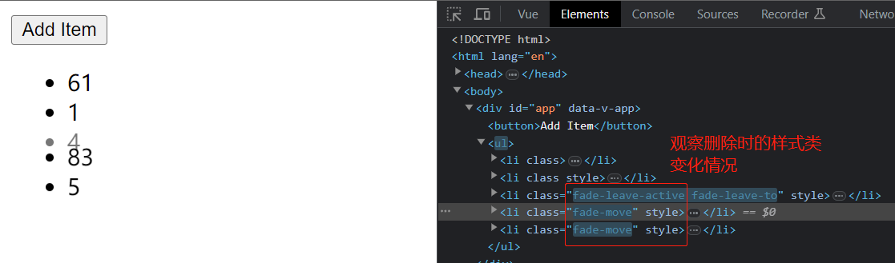

# S07P78: Fixing the Animation


本节是对上一节列表动画的完善，修复其余各项在页面上“跳动”的问题。


## 1 问题描述

上一节示例中，尽管添加与删除元素已经实现了淡入与淡出效果，但这样的效果仅对要删除或添加的单个目标元素生效，对于该位置以下的数组内其余元素，新增或删除时都会有一个明显的“跳动”过程。这就是本节讨论的重点——如果消除其余元素的“跳动”，实现统一的动画效果。


## 2 消除新增时的跳动

通过 Vue 提供的 `*-move` 的样式类消除：（第 12 - 14 行）

```vue
<style>
  .fade-enter-from {
    opacity: 0;
  }
  .fade-enter-active {
    transition: all 1s linear;
  }
  .fade-leave-to {
    transition: all 1s linear;
    opacity: 0;
  }
  .fade-move {
    transition: all 1s linear;
  }
</style>
```

本质：先执行添加的动画，后执行添加的操作，添加过程中的样式通过 `fade-move` 样式类进行控制。


## 3 消除删除时的跳动

同样的 `fade-move` 样式类设置对删除元素不生效，本质原因仍在于 `fade-move` 仅对动画过程生效；而删除时是先执行删除的动画，再执行删除的操作。因此无法控制 DOM 元素删除后、其余元素的“补位动画”。

要控制“补位”出现的跳动，可以在 `fade-leave-active` 类中设置绝对定位，让动画执行时元素就放弃其占位，直接触发其余元素的移动：（第 15 - 17 行）

```vue
<style>
  .fade-enter-from {
    opacity: 0;
  }
  .fade-enter-active {
    transition: all 1s linear;
  }
  .fade-leave-to {
    transition: all 1s linear;
    opacity: 0;
  }
  .fade-move {
    transition: all 1s linear;
  }
  .fade-leave-active {
    position: absolute;
  }
</style>
```

效果如下：（删除元素 4）


