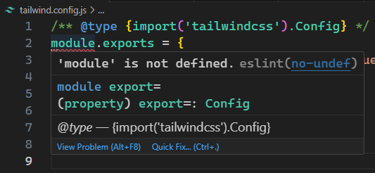

# S09P91: Installing Tailwind

Resources：

- Tailwind Installation: https://tailwindcss.com/docs/guides/vite


## DIY coding

```bash
# installing tailwindcss and its peer dependencies
> npm i -D tailwindcss postcss autoprefixer
# generate configuration files
> npx tailwindcss init -p
# 2 config files generated:
# 1. tailwind.config.js
# 2. postcss.config.js
```

编辑 `tailwind` 配置文件：

```js
/** @type {import('tailwindcss').Config} */
module.exports = {
  content: ['./index.html', './src/**/*.{vue,js,ts,jsx,tsx}'],
  theme: {
    extend: {}
  },
  plugins: []
}
```

注：第 3 行应该与课程内容保持同步（扩展名添加 `vue`）。实操时，`Tailwind CSS` 官方文档并没有包含 `vue` 扩展名，这将导致项目中的初始样式失效。

此时配置文件可能会报错：



手动添加 `ESLint` 配置即可，修改 `.eslintrc.js`，手动指定 `env` 环境节点：

```js
module.exports = {
  root: true,
  extends: [/* ... */],
  overrides: [/* ... */],
  parserOptions: {/* ... */},
  env: {
    node: true
  }
}
```

之所以手动设置，是因为 `ESLint` 默认环境是浏览器。

接着修改 `base.css`：

```css
/* Add the Tailwind directives to your CSS */
@tailwind base;
@tailwind components;
@tailwind utilities;
```

然后在 `main.js` 引入 `base.css`：

```js
import './assets/base.css'
```

最后重启项目：

```bash
> npm run dev
```

